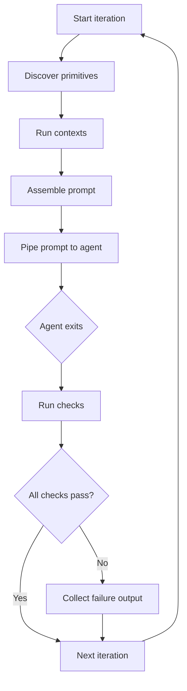

# How it works

This page explains what ralphify does under the hood during each iteration. Understanding the lifecycle helps you write better prompts, debug unexpected behavior, and make informed decisions about checks and contexts.

## The iteration lifecycle

Every iteration follows the same sequence:



Here's what happens at each step.

### 1. Discover primitives

Ralphify scans the `.ralphify/` directory for checks, contexts, and ralphs. This happens **every iteration**, so you can add, edit, or remove primitives on disk while the loop is running — changes take effect on the next cycle.

When running a named ralph (e.g. `ralph run docs`), ralphify also scans the ralph's own directory for local primitives and merges them with any declared global primitives. Local primitives win on name collisions.

### 2. Run contexts

Each enabled context runs its command (or script) and captures the output. Context commands run with the project root as the working directory.

Context output is captured **regardless of exit code** — a command like `pytest --tb=short -q` exits non-zero when tests fail, but its output is exactly what you want in the prompt.

### 3. Assemble the prompt

This is where the pieces come together:

1. **Read the ralph file** — `RALPH.md` (or a named ralph) is read from disk. The YAML frontmatter is stripped; only the body becomes the prompt.
2. **Resolve context placeholders** — each `{{ contexts.name }}` placeholder is replaced with that context's output (the static body text from `CONTEXT.md` followed by the command's stdout). Contexts not referenced by a placeholder are excluded.
3. **Append check failures** — if any checks failed in the previous iteration, their output and failure instructions are appended to the end of the prompt.

The result is a single text string — the fully assembled prompt.

### 4. Pipe prompt to agent

The assembled prompt is piped to the agent command via stdin:

```
echo "<assembled prompt>" | claude -p --dangerously-skip-permissions
```

The agent reads the prompt, does work in the current directory (edits files, runs commands, makes commits), and exits. Ralphify waits for the agent process to finish.

When the agent command is `claude`, ralphify automatically adds `--output-format stream-json --verbose` to enable structured streaming. This lets ralphify track agent activity in real time and extract the final result — you don't need to configure this yourself.

### 5. Run checks

After the agent exits, all enabled checks run in alphabetical order by directory name. Every check runs regardless of whether earlier checks pass or fail.

Each check runs its command (or script) and records the exit code and output:

- **Exit code 0** — check passed
- **Non-zero exit code** — check failed

### 6. Feed failures back

If any checks failed, ralphify formats their output into a structured block:

````markdown
## Check Failures

The following checks failed after the last iteration. Fix these issues:

### tests
**Exit code:** 1

```
FAILED tests/test_auth.py::test_login - AssertionError: expected 200, got 401
```

Fix all failing tests. Do not skip or delete tests.
````

This block is stored and appended to the **next** iteration's prompt in step 3. The agent sees exactly what broke, plus the failure instruction you wrote in the check's `CHECK.md` body — giving it everything it needs to fix the problem.

This is the **self-healing feedback loop**: the agent breaks something, the check catches it, the failure feeds back, and the agent fixes it in the next iteration.

## What gets re-read each iteration

Everything is re-read from disk every iteration. There is no cached state between cycles.

| What | When read | Why it matters |
|---|---|---|
| Prompt file (`RALPH.md` or named ralph) | Every iteration | Edit the prompt while the loop runs — the next iteration follows your new instructions |
| Primitives (`.ralphify/` directory) | Every iteration | Add or remove checks/contexts on disk without restarting |
| Context command output | Every iteration | The agent always sees fresh data (latest git log, current test status, etc.) |
| Check results | Every iteration | Only the most recent failures carry forward — once checks pass, the failure block disappears |

The only state that persists between iterations is the **check failure text** from the previous cycle. Everything else is read fresh.

## How prompt assembly looks in practice

Here's a concrete example. Given this setup:

**`RALPH.md`**

```markdown
---
checks: [tests]
contexts: [git-log]
---

# Prompt

{{ contexts.git-log }}

Read TODO.md and implement the next task.
```

**`.ralphify/contexts/git-log/CONTEXT.md`**

```markdown
---
command: git log --oneline -5
---
## Recent commits
```

**`.ralphify/checks/tests/CHECK.md`**

```markdown
---
command: uv run pytest -x
timeout: 120
---
Fix all failing tests.
```

### Iteration 1 (no prior failures)

The assembled prompt piped to the agent:

```markdown
# Prompt

## Recent commits
a1b2c3d feat: add user model
e4f5g6h fix: resolve database connection timeout
i7j8k9l docs: update API reference

Read TODO.md and implement the next task.
```

Context placeholder replaced, no check failures to append.

### Iteration 2 (tests failed in iteration 1)

```markdown
# Prompt

## Recent commits
x1y2z3a feat: add login endpoint
a1b2c3d feat: add user model
e4f5g6h fix: resolve database connection timeout

Read TODO.md and implement the next task.

## Check Failures

The following checks failed after the last iteration. Fix these issues:

### tests
**Exit code:** 1

FAILED tests/test_auth.py::test_login - AssertionError

Fix all failing tests.
```

The git log context is fresh (shows the new commit from iteration 1). The check failure from iteration 1 is appended at the end. The agent sees both and knows to fix the failing test before moving on.

## Primitive execution order

Checks and contexts run in **alphabetical order by directory name**. To control the order, use number prefixes:

```
.ralphify/checks/
├── 01-lint/CHECK.md        # Runs first
├── 02-typecheck/CHECK.md   # Runs second
└── 03-tests/CHECK.md       # Runs third
```

All checks run regardless of whether earlier checks pass or fail — you always get the full picture.

## Stop conditions

The loop continues until one of these happens:

| Condition | What happens |
|---|---|
| `Ctrl+C` | Loop stops after the current iteration finishes |
| `-n` limit reached | Loop stops after completing the specified number of iterations |
| `--stop-on-error` and agent exits non-zero | Loop stops immediately (checks don't run for that iteration) |
| `--timeout` exceeded | Agent process is killed, iteration is marked as timed out, loop continues (unless `--stop-on-error`) |

## Next steps

- [Getting Started](getting-started.md) — set up your first loop
- [Writing Prompts](writing-prompts.md) — patterns for effective autonomous loop prompts
- [Primitives](primitives.md) — full reference for checks, contexts, and ralphs
- [Troubleshooting](troubleshooting.md) — when things don't work as expected
